# Dynamic and Adaptive Calling Context Encoding (DACCE)
<!-- _class: invert -->
## Jainjum Li et al.
### Published in CGO '14

---
# Main Idea
* DACCE dynamically apply PCCE using discovered nodes and edges at runtime.
* It uses encoding (edge weights) for discovered paths and uses a shadow stack (ccStack) for undiscovered paths.
* Decoding logics deals with both PCCE's decoding logic and stack unwinding.

---
# Main Idea
* As more nodes and edges are discovered, re-encoding is triggered.
* Encoding optimization with runtime information
  * edge-weight placement, hashing for indirect call, counter for recursive.
* Shows less runtime overhead compared to PCCE naively integrated in dynamic instrumentation.

---
# Contents
* How to encode/instrument/decode
  * unencoded, indirect, recursive, DLL, and tail calls.
* Adaptive Encoding Process
* Timing of Encoding.
* Handling multi-threaded programs
* Decoding with multiple re-encodings
* Evaluation

---
# Unencoded edges (normal calls)
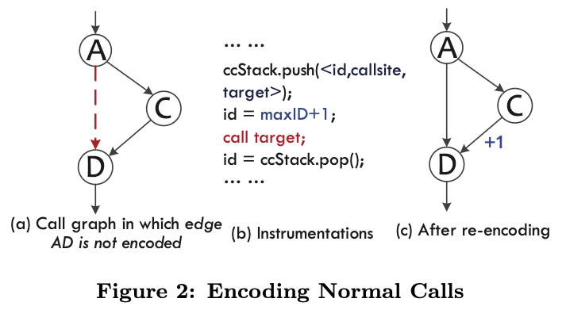

---
# Decoding algorithm
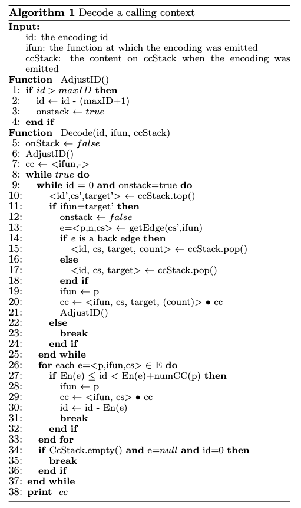

---
# Indirect calls
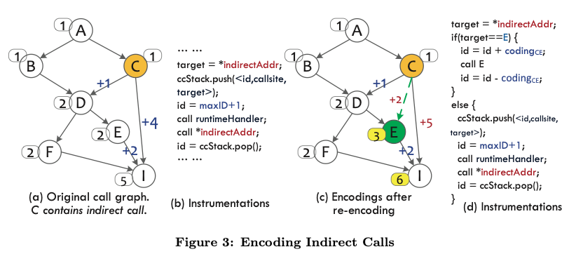

---
# Indirect calls
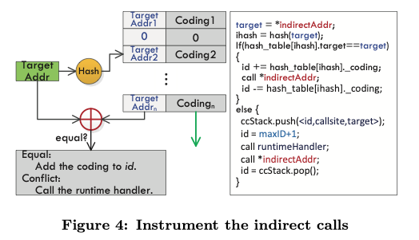

---
# Recursive calls
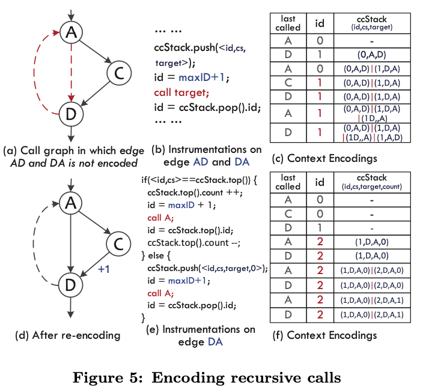

---
# Dynamically linking library (via PLT).
* Hook PLT call to do the followings
  * get the real target address of PLT call.
  * edge between callsite and the real target is added to the call graph.
  * Not encoded until the next re-encoding process.
  * Instrement code as normal call (Figure 2.b)

---
# Tail Calls
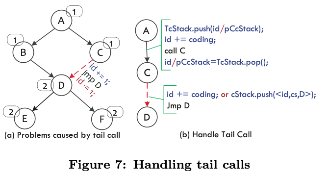

---
# Tail Calls
* How to identify the tail calls?
  > We can observe that the encoding context is identical before and after an invocation.
* From the caller, how does call site handles both normally returning from caller or returning from callee of callee?
* How to handle tail calls via indirect branches?

---
# Adaptive Encoding Process
* Decode the collected contexts, mark the frequently invoked call edges.
* Encode the whole call graph.
  * Assign 0 weight to frequently invoked call (edge).
* Adjust ccStack.
  * If calls are highly repetitive (many recursive calls), adjust the encoding algorithm on recursive calls to compress the saved contexts on ccStack.

---
# Adaptive Encoding Process
* Instrument the program with the new encodings.
* After instrumentation, the currend id and entries on ccStack are regenerated according to the new encodings.

---
## Timing of Re-encode
  * The number of identified call edges reaches a threshold.
  * The frequently invoked call paths have changed.
  * The ccStack is frequently accessed.
  * The paper does not discuss threshold of above.

---
## Handling multi-threaded programs
* Stop the execution of all threads.
  * By registering a signal handler for all threads in the process
* one id per one thread (stored in TLS)
* one ccStack per one thread
* Architectures support TLS (%gs:tlsoffset or %fs:tlsoffset in X86).

---
## Decoding with multiple re-encodings
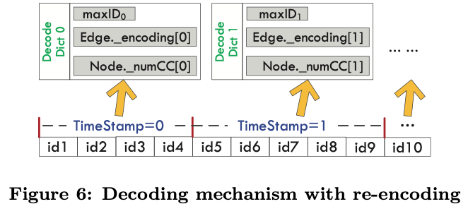

---
# Evaluation - Framework
* DACCE as a shared library on linux.
* LD_PRELOAD to intercept the __libc_start_main
  * All calls in main are instrumented to call runtime function in dacce.so
  * What instrumentation tool or library used?
* Implement libpfm4 to verify correctness and effectiveness
  * sample the program and record the context id periodically.
  * cross checked with context id from dacce.

---
# Evaluation - Platform
* 2-way Intel Xeon server
* 1.87 GHz Intel Xeon E7-4807.
* SPEC2006 and Parsec 2.1

---
### Benchamarks characteristics
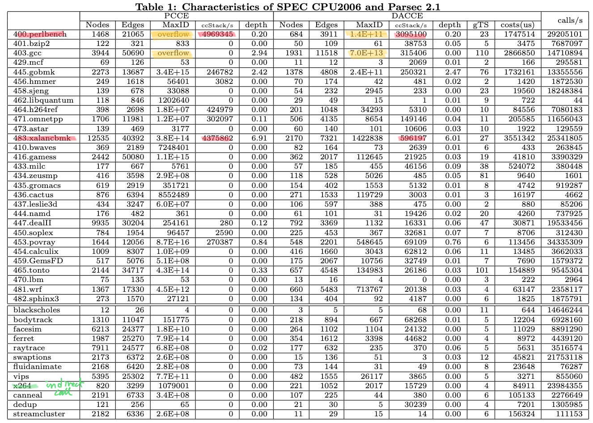

---
# Runtime overhead
* Normal call
  * + Ability to find the better place for zero edge weight (not in evaluation).
  * - Encoding overhead at runtime. 
    * Frequency and timing of encoding affect the runtime overhead.
* Recursive call
  * Both relies on stack
  * + DACCE does not consider edges as backedges until it forms a cycle in an updated (partial) call graph.
    * PCCE identifies more edges as backedges with a complete call graph.
    * More backedges, more stack operations
* Indirect call
  * If the frequently invoked indirect call has many jump targets,
    * - PCCE's instrumentation incurs huge if-else statement
    * + DACCE's instrument use hash function to find the encoding (edge weight).

---
# Runtime overhead
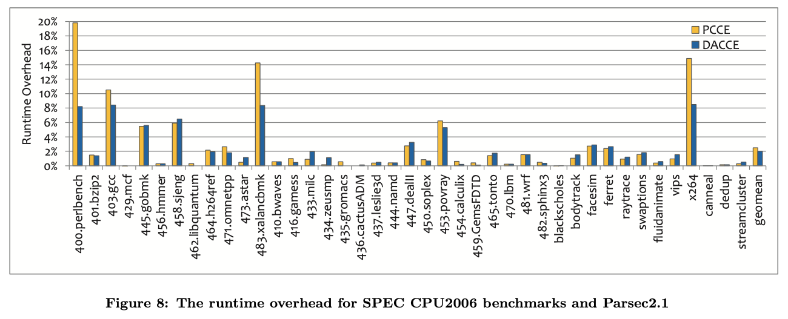

---
# Number of encoded nodes/edges/maxID over time
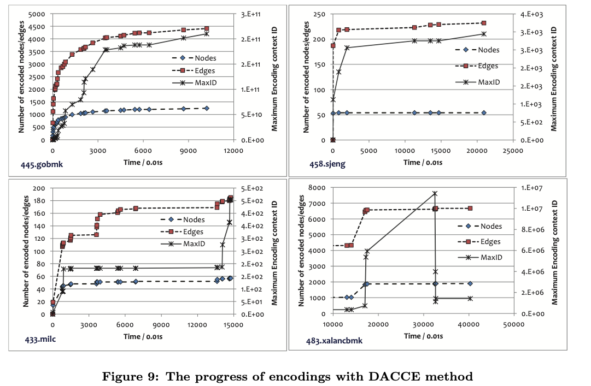

---
# Cummulative distributions of the stack depth
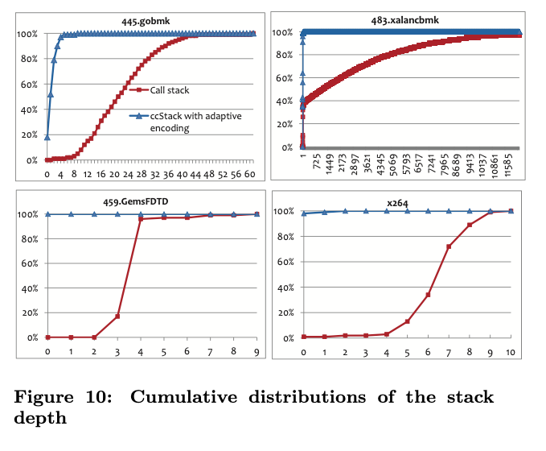

--- 
## Comparison to Dynamic DCCE and DrCCTProf

||DACCE|DrCCTProf|DCCE|Comment|
|---|---|---|---|---|
|Distinguishable|No|Yes|Yes||
|Persistent|No|No|Yes||
|CCID Overflow|Allocate IDs to paths|Allocate CCIDs to paths (dynamically)|Allocate CCIDs to paths (statically)|Need discussion|
|Be Dynamic/Adaptible|Yes|Yes|No|Indirect call, DLL|
|Overhead of Encoding|Stack Operation or Add/Sub|Tree Operations|CCW Lookup, Add/Sub|DCCE<DrCCTProf (Need clear reasoning)|
|Overhead of Calling Context Comparison (membership check)|Need decoding due to persistent issue|Need decoding due to persisten issue|No decoding|DCCE<DrCCTProf<DACCE

--- 
## Comparison to Pure Dynamic DCCE 
* + Pure Dynamic DCCE dynamically compute edge weight with a new call site.
  * One CCW lookup, 
* - Can't adapt some benefits of dynamic instrumentation such as dynamic encoding or optimization.
* - More vulnerable to MaxID overflow.

---
# TODO's
* Study tail call details
  * How to identify it in LLVM IR.
  * How to encode it
