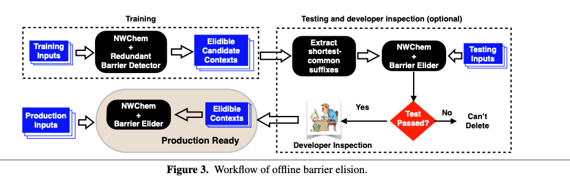
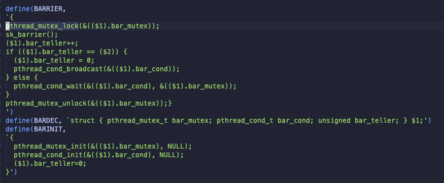
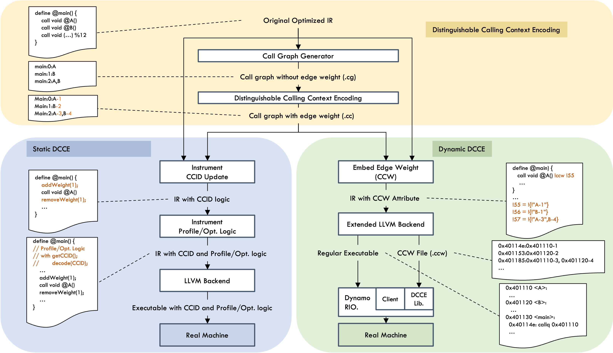
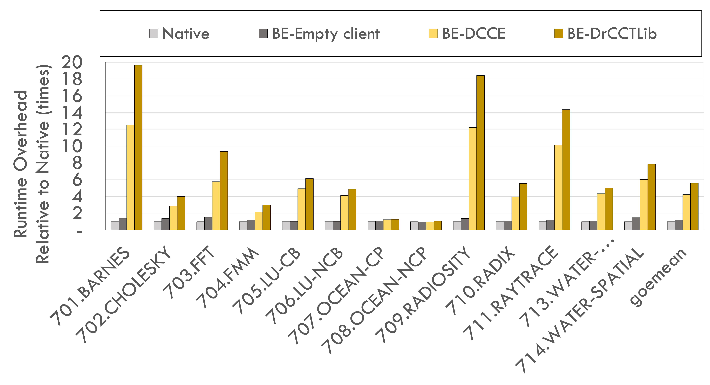
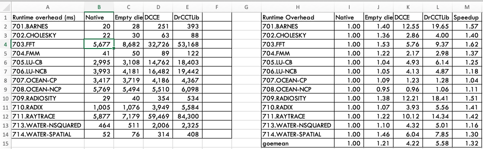
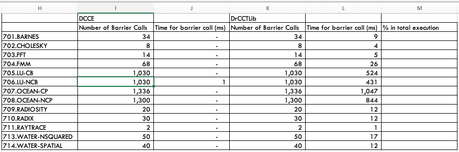

# Directions
We need to come up with better evaluation method and to discuss with prior works by studying
- study exactly what clients do with calling contexts in more detail.
  - Contextual dispatch for function, Barrier Elision, and WHISTLE
- study exactly what operations prior encoding schemes need for calling context comparison.
  - Dynamic and Adaptive Calling Context Encoding
  - Probabilistic Calling Context

---
# Last week,
- Discussed DACCE
  - Non-persistent encoding scheme.
  - DrCCTProf is the most recent work encoding scheme using dynamic analysis (so it's non-persistent)
- TODO:
  - Experiment runtime overhead of non-persistent encoding scheme with target clients (Barrier Elision and others)

---
# In this week,
- Experimented the overhead of non-persistent encoding scheme with Barrier Elision 

---
## Target Client

Our target clients have the following steps in their work
- Profiled/Analyzed results are classified with calling context.
  - Set of calling context that can skip barrier call (Barrier Elision).
  - Best function version for a call site (Contextual dispatch).
  - Set of (PCs, Addrs) for each calling context (WHISTLE).
- The classified data is referred at production run.
- In this week, Barrier Elision is used for the runtime overhead study.

---
## Barrier Elision - Work flow

---
## Barrier Elision - extended barrier function

---
## Barriers in Splash-3

- Can't hook pthread functions due to no symbol
- For now, add dummy barrier call "sk_barrier" in the macro.

---
## Barrier Client in Dynamic-DCCE

---
## Barrier Client in Dynamic-DCCE
- Need to write two barrier clients on top of DCCELib and DrcctProf.
- Assume that once DrcctProf does extra operations for persistent encoding, checking routines are identical.
 - No need to implement.
- See the source code

---
## Result - Runtime Overhead

---
## Result - Runtime Overhead

---
## Result - Number of Barrier calls

- How to get % of barrier-elision operations out of total?
  - Runtime is collected without code for statistics.

---
## Issue with Splash-3
- Native Runtime is too short for some benchmarks (less than 1 sec)
- Seems not many barrier calls.
  - Some number of barrier calls are proportional to the data size.
- Runtime and number of barrier calls are dependent on data size (checked with few bench)
  - May need to create big size input
- Need to find another benchmarks or make a micro benchmarks
  - Try [NWWhem](https://www.nwchem-sw.org)
  - lud, backprop, sgemm, pagerank

---
# Next week,
- Make or find benchmarks running longer (and many barrier calls)
- Paper Discussion
  - PCC (probabilistic calling context encoding)
  - Contextual dispatch for function specialization
- Integrate Pthread?
- Check the paper from [Tanvir](https://web.eecs.umich.edu/~takh/#news)
