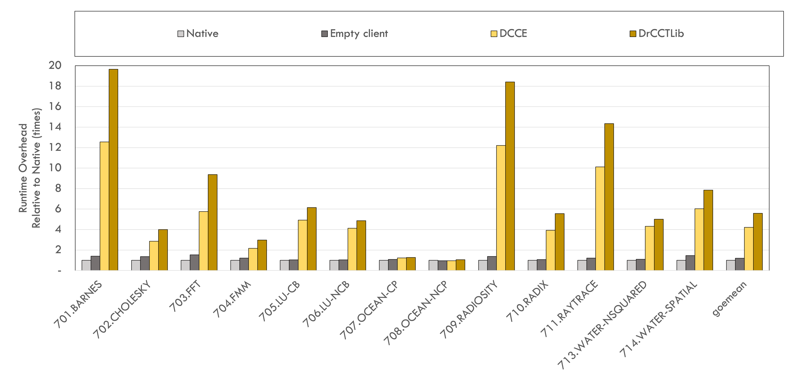
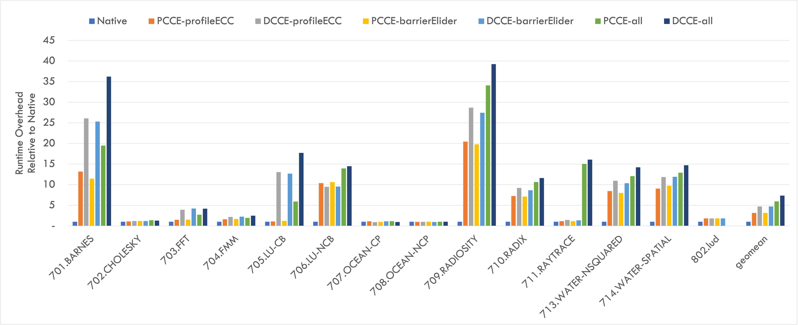
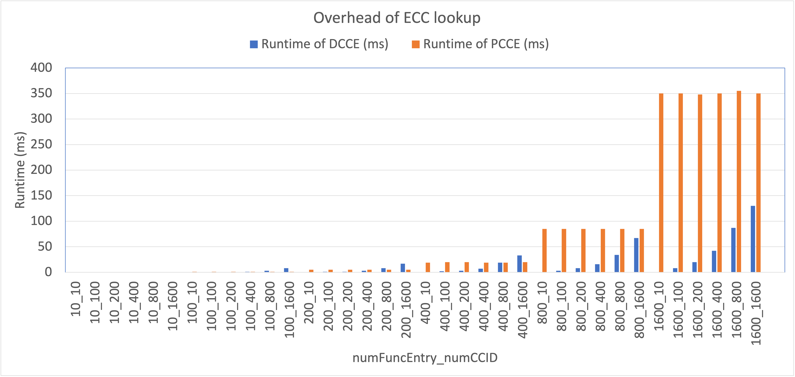
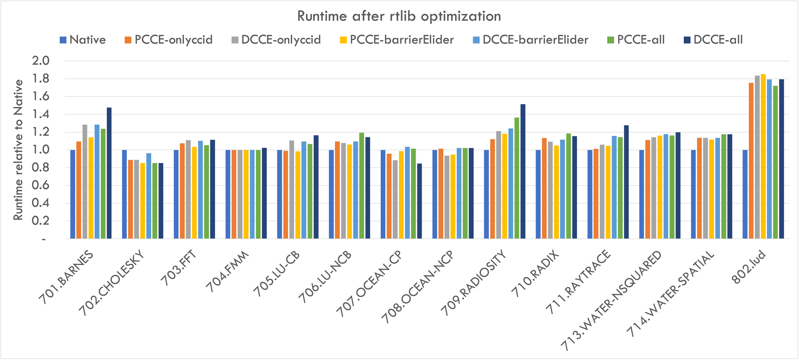
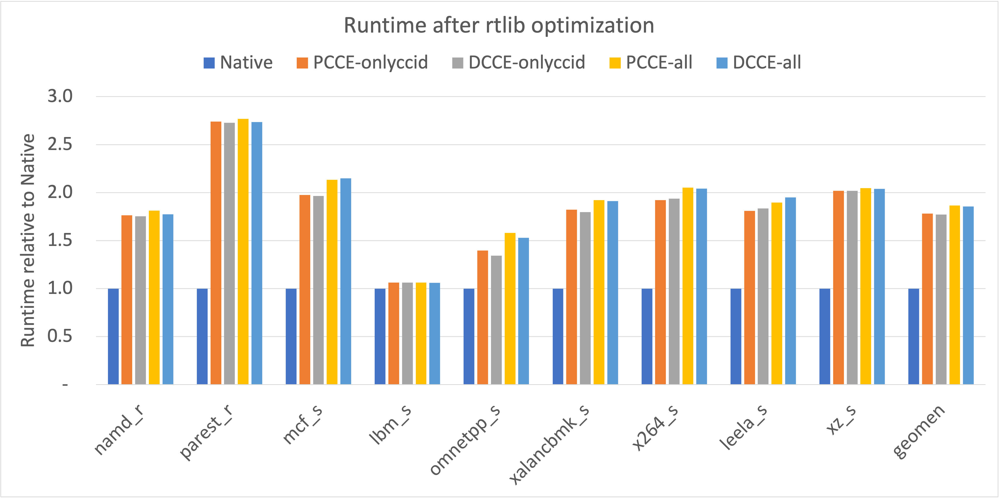
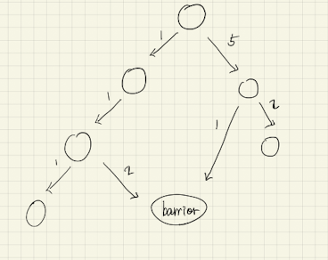
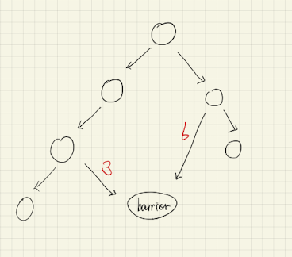
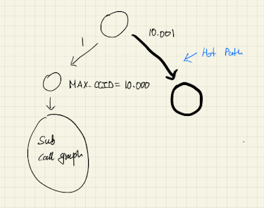
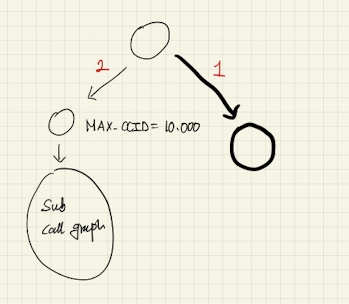

# Progress - Runtime Evaluation using Barrier Elision
- Setup Pthread Library to hook
- Update LLVM Pass to hook barrier function call
- Implement profileECC/barrierElider call in rtlib
- Optimization of runtime lib (using TLS)
- Optimization of encoding (In Progress)
- Setup nwchem (In Progress)

---
# DCCE-Dynamic

---
# DCCE-Static (before rtlib optimization)

---
# Overhead ECC lookup

---
# DCCE-Static (after rtlib optimization)

---
# DCCE-Static (SPEC2017)

---
# Client sensitive optimization

---
# Client sensitive optimization

---
# Small Weight on Hot Path

---
# Small Weight on Hot Path

